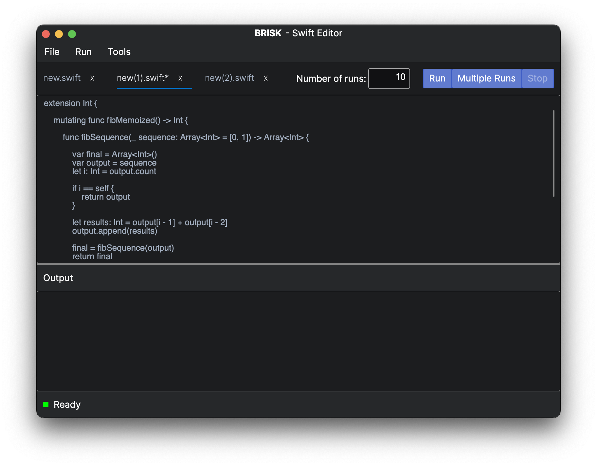
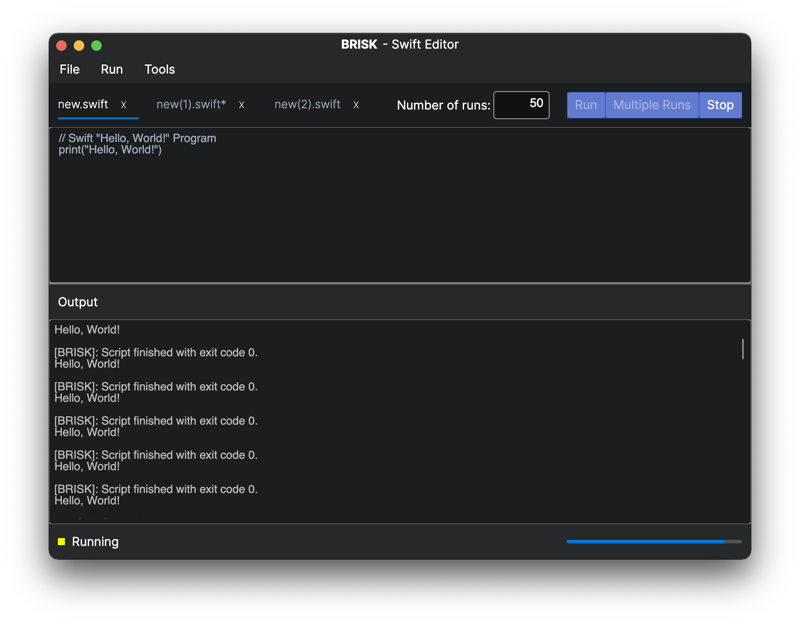
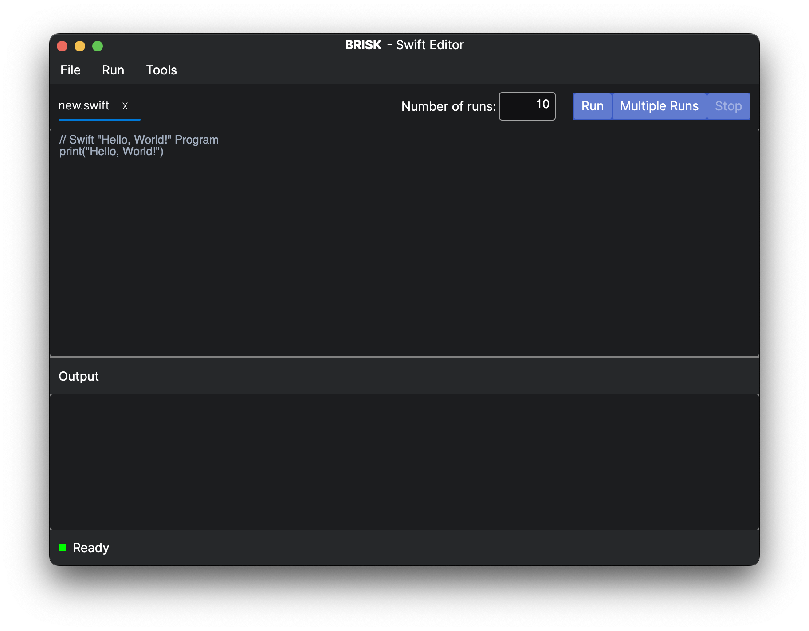
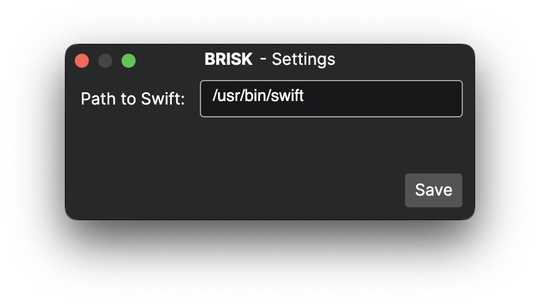

# Brisk - A cross-platform editor for Swift

Brisk is a simple GUI tool that features an editor for Swift code.
It allows the user to write and run Swift code in a *simple* way.



## Features

In its current state, the editor is very basic.
Due to some of the decisions made during the development, it is not possible to easily add text-related features, such as syntax highlighting.
However, as it is, the editor is cross-platform and can be used to write and run Swift code.

- [x] Editor and output panes
- [x] Code execution
- [x] Interactive environment for long-running programs
- [x] Indication of whether the code is running or not
- [x] Indication of the exit code of the program
- [x] Batch execution of code
- [x] Multiple tabs
- [x] Hotkeys for common actions



## Running Brisk

The editor is written in C# and targets .NET 7.
In order to guarantee that the editor works on all platforms, it uses the [Avalonia](https://avaloniaui.net/) UI framework.
Avalonia help bring WPF-like UI to all platforms, including Windows, Linux and macOS.
These three are the ones targeted by Brisk.

The project was developed on MacOS using Rider and the Avalonia plugin.
The solution can be opened in Rider and the project can be run from there.
A full guide on how to do this can be found [here](https://docs.avaloniaui.net/docs/getting-started/ide-support/jetbrains-rider-setup).

Once the Avalonia dependency is resolved, the project can also be launched from CLI using the following command:

```
dotnet run --project Brisk/Brisk.csproj 
```

You should be greeted with the following window:



## Usage

Upon launching the editor, the user is greeted with a single tab containing a simple "Hello World" program.
The content can be saved to a file by clicking the "Save" button in the "File" menu or by using the `Ctrl+S` hotkey.
Note that the editor does not support closing tabs, which is a bit of an inconvenience.

Typing into the editor changes the content of the tab.
The tab can either be saved manually, or automatically when running the code.

The user can create a new tab by clicking the "New" button in the "File" menu or by using the `Ctrl+T` hotkey.
Switching between tabs can be done by clicking on the tab, which changes the content shown in the editor.
It is also possible to open existing files by clicking the "Open" button in the "File" menu.
This creates a new tab with the content of the file.

Before running the code, the user must specify the path to the Swift executable.
This is by default set to `/usr/bin/swift`, but can be changed in the "Settings" menu under "Tools".



In order to execute the code once, press the "Run" button in the toolbar.
The output will be displayed in the output pane.
During the execution, the "Run" button will be replaced with a "Stop" button and a progress bar will appear.
Use "Stop" to cancel the execution.

In order to execute the code multiple times, press the "Multiple Runs" button in the toolbar.
The number of times the code will be executed can be specified in the "Number of runs" numeric box.
The limit is arbitrarily set to 999.

When running the code multiple times, the output will be displayed in the output pane.
The progress bar will update based on the number of past runs.
Canceling the execution stops the entire batch, not just the current task.
